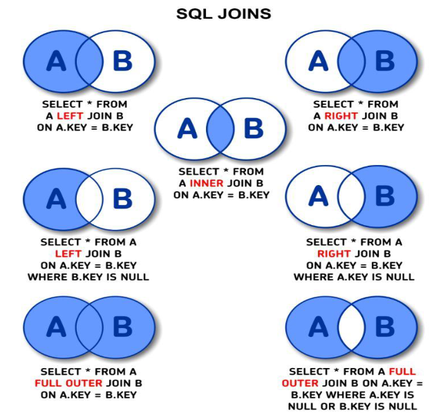

# 📘 Resumen SQL — Gestión de Datos

## 🏗️ DDL (Data Definition Language)
Lenguaje de definición: crea, modifica o elimina estructuras de base de datos.

| Comando | Descripción | Ejemplo |
|----------|--------------|---------|
| `CREATE DATABASE` | Crea una nueva base de datos | `CREATE DATABASE gestion_datos;` |
| `CREATE TABLE` | Crea una tabla nueva | `CREATE TABLE alumno (id INT, nombre VARCHAR(50));` |
| `ALTER TABLE` | Modifica una tabla existente | `ALTER TABLE alumno ADD COLUMN edad INT;` |
| `DROP TABLE` | Elimina una tabla | `DROP TABLE alumno;` |
| `TRUNCATE TABLE` | Borra todos los datos de una tabla sin eliminar su estructura | `TRUNCATE TABLE alumno;` |

---

## 🧾 DML (Data Manipulation Language)
Lenguaje de manipulación: gestiona los datos dentro de las tablas.

| Comando | Descripción | Ejemplo |
|----------|--------------|---------|
| `INSERT INTO` | Inserta nuevos registros | `INSERT INTO alumno (id, nombre, edad) VALUES (1, 'Juan', 22);` |
| `UPDATE` | Modifica registros existentes | `UPDATE alumno SET edad = 23 WHERE id = 1;` |
| `DELETE` | Elimina registros  | `DELETE FROM alumno WHERE id = 1;` |
| `SELECT` | Consulta datos | `SELECT * FROM alumno;` |

---

## 🔍 Consultas con SELECT

| Cláusula | Descripción | Ejemplo |
|-----------|--------------|---------|
| `WHERE` | Filtra filas según condiciones | `SELECT * FROM alumno WHERE edad > 20;` |
| `ORDER BY` | Ordena el resultado | `SELECT * FROM alumno ORDER BY nombre ASC;` |
| `GROUP BY` | Agrupa resultados | `SELECT carrera, COUNT(*) FROM alumno GROUP BY carrera;` |
| `HAVING` | Filtra grupos (después del GROUP BY) | `SELECT carrera, COUNT(*) FROM alumno GROUP BY carrera HAVING COUNT(*) > 10;` |
| `DISTINCT` | Elimina duplicados (devuelve las filas sin repetir) | `SELECT DISTINCT carrera FROM alumno;` |
| `LIMIT` / `TOP` | Limita la cantidad de filas devueltas | `SELECT * FROM alumno LIMIT 5;` |

📏 DIFERENCIA ENTRE TOP Y LIMIT
=============================================================================================================

| PALABRA CLAVE  | POSICIÓN EN LA CONSULTA    | EJEMPLO                                       |
| LIMIT       | Al final de la consulta     | SELECT * FROM alumno LIMIT 5;                 |
| TOP         | Después del SELECT          | SELECT TOP 5 * FROM alumno;                   |

-------------------------------------------------------------------------------------------------------------
🧩 NOTAS:
- Ambos sirven para limitar la cantidad de filas devueltas.
- LIMIT también permite usar OFFSET para paginar resultados:
    SELECT * FROM alumno LIMIT 5 OFFSET 10;
  → Devuelve 5 filas empezando desde la número 11.
- TOP puede usar porcentajes:
    SELECT TOP 10 PERCENT * FROM alumno;
  → Devuelve el 10% superior del conjunto de resultados.
-------------------------------------------------------------------------------------------------------------

---

## 🔗 JOINs (Combinación de tablas)

### - es en funcion de una columna relacionada entre ellas 

#### Aspectos a tener en cuenta:
1. Especificar la columna de cada tabla que se utilizara para la combinacion
2. Especificar un operador logico (por ejemplo = o <>), que se usara para comparar valores de las columnas 

| Tipo de JOIN | Descripción | Ejemplo |
|---------------|--------------|---------|
| `INNER JOIN` | Devuelve solo coincidencias entre tablas | `SELECT * FROM alumno a INNER JOIN curso c ON a.id_curso = c.id;` |
| `LEFT JOIN` | Devuelve todos los registros de la tabla izquierda y coincidencias de la derecha | `SELECT * FROM alumno a LEFT JOIN curso c ON a.id_curso = c.id;` |
| `RIGHT JOIN` | Devuelve todos los registros de la tabla derecha y coincidencias de la izquierda | `SELECT * FROM alumno a RIGHT JOIN curso c ON a.id_curso = c.id;` |
| `FULL JOIN` | Devuelve todos los registros cuando hay coincidencia en cualquiera de las tablas | `SELECT * FROM alumno a FULL JOIN curso c ON a.id_curso = c.id;` |

---

## ⚙️ Funciones SQL comunes

| Tipo | Descripción | Ejemplo |
|-------|--------------|---------|
| **Agregación** | Operan sobre conjuntos de filas | `COUNT()`, `SUM()`, `AVG()`, `MIN()`, `MAX()` |
| **Texto** | Manipulan cadenas | `UPPER(nombre)`, `LOWER(nombre)`, `LENGTH(nombre)` |
| **Fecha y hora** | Calculan sobre campos de fecha | `NOW()`, `YEAR(fecha)`, `DATEDIFF(fecha1, fecha2)` |
| **Condicionales** | Evalúan condiciones | `CASE WHEN edad > 18 THEN 'Mayor' ELSE 'Menor' END` |

---

## 🔐 DCL (Data Control Language)

| Comando | Descripción | Ejemplo |
|----------|--------------|---------|
| `GRANT` | Otorga permisos a un usuario | `GRANT SELECT ON alumno TO user1;` |
| `REVOKE` | Revoca permisos | `REVOKE SELECT ON alumno FROM user1;` |

---

## 🧱 TCL (Transaction Control Language)

| Comando | Descripción | Ejemplo |
|----------|--------------|---------|
| `BEGIN TRANSACTION` | Inicia una transacción | `BEGIN TRANSACTION;` |
| `COMMIT` | Guarda los cambios permanentes | `COMMIT;` |
| `ROLLBACK` | Revierte los cambios realizados | `ROLLBACK;` |

## ⚖️ Condiciones de comparación en SQL

| Operador | Descripción | Ejemplo |
|-----------|--------------|---------|
| `=` | Igual a | `SELECT * FROM alumno WHERE edad = 20;` |
| `<>` ó `!=` | Distinto de | `SELECT * FROM alumno WHERE carrera <> 'ITI';` |
| `>` | Mayor que | `SELECT * FROM alumno WHERE nota > 7;` |
| `<` | Menor que | `SELECT * FROM alumno WHERE edad < 18;` |
| `>=` | Mayor o igual que | `SELECT * FROM alumno WHERE nota >= 6;` |
| `<=` | Menor o igual que | `SELECT * FROM alumno WHERE edad <= 25;` |
| `BETWEEN ... AND` | Dentro de un rango (Tambien se puede negar) | `SELECT * FROM alumno WHERE nota BETWEEN 6 AND 10;` |
| `NOT BETWEEN ... AND` | Fuera de un rango | `SELECT * FROM alumno WHERE edad NOT BETWEEN 18 AND 25;` |
| `IN (...)` | Coincide con algún valor de una lista | `SELECT * FROM alumno WHERE carrera IN ('ITI', 'IND');` |
| `NOT IN (...)` | No coincide con ninguno de la lista | `SELECT * FROM alumno WHERE carrera NOT IN ('ITI', 'IND');` |
| `LIKE` | Compara patrones de texto (comodines) | `SELECT * FROM alumno WHERE nombre LIKE 'J%';` |
| `NOT LIKE` | No cumple con el patrón | `SELECT * FROM alumno WHERE nombre NOT LIKE 'A%';` |
| `IS NULL` | Es nulo (sin valor) | `SELECT * FROM alumno WHERE nota IS NULL;` |
| `IS NOT NULL` | No es nulo | `SELECT * FROM alumno WHERE nota IS NOT NULL;` |

---

### Comodines 

- % para búsquedas amplias y _ para coincidencias exactas por posición.

| Comodín                       | Significado                                           | Ejemplo           | Resultado                                                       |
| ----------------------------- | ----------------------------------------------------- | ----------------- | --------------------------------------------------------------- |
| `%`                           | Representa cualquier cantidad de caracteres (0 o más) | `LIKE 'A%'`       | Nombres que empiezan con A (`Ana`, `Alberto`, `Aldana`)         |
| `%` (colocado antes)          | Representa cualquier texto previo                     | `LIKE '%n'`       | Nombres que terminan con n (`Joaquín`, `Belén`, `Iván`)         |
| `%` (en medio)                | Representa texto entre dos partes conocidas           | `LIKE '%ar%'`     | Nombres que contienen “ar” (`Carlos`, `Eduardo`, `Marcela`)     |
| `_`                           | Representa un solo carácter                           | `LIKE '_u%'`      | Palabras cuya segunda letra sea “u” (`Lucas`, `Rubén`, `Dulce`) |
| `[]` *(solo en SQL Server)*   | Representa un conjunto de caracteres posibles         | `LIKE '[AEIOU]%'` | Palabras que empiezan con vocal                                 |
| `[^ ]` *(solo en SQL Server)* | Excluye un conjunto de caracteres                     | `LIKE '[^A]%'`    | Palabras que no empiezan con A                                  |

### ⚙️ Ejemplos prácticos

| Consulta                                            | Significado                                                |
| --------------------------------------------------- | ---------------------------------------------------------- |
| `SELECT * FROM alumno WHERE nombre LIKE 'J%';`      | Nombres que empiezan con “J”                               |
| `SELECT * FROM alumno WHERE nombre LIKE '%ez';`     | Nombres que terminan con “ez” (p. ej. “Martínez”, “López”) |
| `SELECT * FROM alumno WHERE nombre LIKE '%ar%';`    | Nombres que contienen “ar”                                 |
| `SELECT * FROM alumno WHERE nombre LIKE '_a%';`     | Nombres donde la segunda letra es “a”                      |
| `SELECT * FROM alumno WHERE nombre NOT LIKE '%a%';` | Nombres que no contienen “a”                               |

| Tipo de búsqueda           | Patrón   | Ejemplo          | Resultado                            |
| -------------------------- | -------- | ---------------- | ------------------------------------ |
| Empieza con...             | `'A%'`   | `LIKE 'A%'`      | Palabras que **empiezan con A**      |
| Termina con...             | `'%z'`   | `LIKE '%z'`      | Palabras que **terminan con z**      |
| Contiene...                | `'%an%'` | `LIKE '%an%'`    | Palabras que **contienen “an”**      |
| Segunda letra específica   | `'_a%'`  | `LIKE '_a%'`     | Palabras con **segunda letra “a”**   |
| Longitud exacta (3 letras) | `'___'`  | `LIKE '___'`     | Palabras de **3 caracteres exactos** |
| No contiene...             | `'%x%'`  | `NOT LIKE '%x%'` | Palabras que **no contienen “x”**    |

### DIFERENCIA ENTRE HAVING Y WHERE
-> where -> lo usamos para limitar -> es una condicion sobre el select que NO PERMITE CONDICION CON FUNCION DE AGREGACION
-> having -> lo usamos para limitar -> condicion sobre el GROUP BY con funcion de agregacion 

### ⚙️ Triggers (Disparadores) en SQL

- Los triggers (o disparadores) son bloques de código SQL que se ejecutan automáticamente cuando ocurre un determinado evento en una tabla (como una inserción, actualización o eliminación).
Se usan para automatizar tareas, mantener integridad de datos o registrar auditorías sin intervención manual.

#### 🔹 ¿Qué es un Trigger?

- Un trigger se asocia a una tabla y se activa cuando ocurre un evento (INSERT, UPDATE o DELETE), ya sea antes o después de que la operación se ejecute.

### 🔸 Tipos de triggers

| Momento de ejecución | Evento que lo dispara        | Descripción                                                | Ejemplo de uso                                              |
| -------------------- | ---------------------------- | ---------------------------------------------------------- | ----------------------------------------------------------- |
| `BEFORE INSERT`      | Antes de una inserción       | Permite validar o modificar los datos antes de insertarlos | Verificar que una nota esté entre 0 y 10 antes de agregarla |
| `AFTER INSERT`       | Después de una inserción     | Realiza acciones tras insertar un registro                 | Registrar el alta en una tabla de auditoría                 |
| `BEFORE UPDATE`      | Antes de una actualización   | Permite validar o modificar valores antes de actualizar    | Evitar que se cambie el ID de un alumno                     |
| `AFTER UPDATE`       | Después de una actualización | Ejecuta acciones luego de actualizar un registro           | Registrar el cambio en una tabla de logs                    |
| `BEFORE DELETE`      | Antes de una eliminación     | Puede bloquear o validar una eliminación                   | Evitar borrar usuarios con deudas                           |
| `AFTER DELETE`       | Después de una eliminación   | Ejecuta una acción posterior a la eliminación              | Guardar el registro eliminado en una tabla de historial     |

### Control de errores
- Durante la ejecucon del codigo pueden ocurrir errores. 
- Try .... Catch

- Try -> lo que esta dentro se ejecuta normalmente 
- Catch -> Si ocurre un error en el try pasa al catch y se interrumpe

#### Funciones de error dentro del CATCH 
- ERROR_NUMBER()
- ERROR_MESSAGE()
- ERROR_LINE()
- ERROR_SEVERITY()
- ERROR_STATE()

## ROLLBACK TRANSACTION
- Cancela la transaccion 
  -> Debe tener un BEGIN asociado
  -> Ante una falla dejo la base de datos tal y como estaba antes 
  -> Lo que le decimos: volve para atras desde el momento que hice el begin transaction 

## UNIONES
- Union -> no permite registros duplicados -> unificar dos consultas -> pone una abajo de la otra 
  - el join, a diferencia, te devuelve en horizontal todo 
  - las columnas en union deben ser las mismas y el mismo tipo de dato
  - es sensible al orden 
- Union all -> si acepta registros duplicados 

Supongamos que tenemos estudiantes y docentes. Si hago un union en una query voyy a tener los estudiantes y docentes 
Por ejemplo si mica es estudiante en el union no se repetiria pero en el union all si 

1. from 
2. where
3. group by
4. having 
5. select
6. order by

si hay un campo que no es funcion de agregacion siempre debe ir group by 

En los procedures no nos interesan cosas historicas

## PROCEDURES Y TRIGGERS

- Stored Procedure → bloque de sentencias que ejecuto a pedido (con EXEC). Puede recibir parametros y devolver resultados (SELECT), codigos (RETURN) o valores por OUTPUT

- Trigger → bloque de sentencias SQL que se ejecuta solo ante un evento DML en una tabla (INSERT, UPDATE O DELETE). No lo llamo sino que lo dispara la base. Usa las tablas virtuales inserted y deleted para ver los valores nuevo/viejo. 

| Tema                      | Procedure                            | Trigger                                                   |
| ------------------------- | ------------------------------------ | --------------------------------------------------------- |
| ¿Quién lo ejecuta?        | Vos (o la app) con `EXEC`            | SQL Server automáticamente ante un `INSERT/UPDATE/DELETE` |
| Parámetros                | **Sí** (entrada/salida)              | **No** (no tiene parámetros)                              |
| Momento                   | Cuando lo llamás                     | Justo después (o en vez de) la sentencia DML de la tabla  |
| Tablas `inserted/deleted` | No aplica                            | **Sí**, para ver los cambios                              |
| Uso típico                | Listados, ABMs, tareas reutilizables | Integridad de datos, lógicas automáticas, denormalización |

### Cuando valela pena un stored procedure?
→ Hay que pensarlo como una funcion reutilizable que vive en la base y que llama un EXEC

|Utilidades | Descripcion | Ejemplos |
|----------------------------------------------------|------------------------------------------|--------------|
| 1. Repetir la misma consulta o tarea muchas veces | |Ej. "listar titulos por editorial" con distintos @pub_id |
| 2. Parametrizar sin recibir SQL | Cambiar filtros sin reescribir SQL (fechas, estados, ids)| |
| 3. Encapsular reglas de negocio sencillas | Calculos/ validaciones en un mismo lugar | Ej. Si el precio es null, tratalo como 0, devolveme tambien el total |
| 4. Reducir trafico entre app y base | | Envio EXEC mi_proc @p = 123 en lugar de una consulta armada cada vez |
| 5. Seguridad / Abstraccion | Dar permisos para ejecutar el procedure sin exponer directamente las tablas | |
| 6. Devolver datos o un valor calculado | Puede devolver un select, un codigo con un RETURN o parametros OUTPUT | |

### Queda guardado? Lo puedo volver a usar? 

- Si. Cuando se crea con CREATE PROCEDURE, queda almacenado en la base hasta que alguien lo modifique (ALTER PROCEDURE) o lo borre (DROP PROCEDURE)
Mientras se esté en la misma base de datos y tenga permisos, siempre se puede llamar con EXEC 